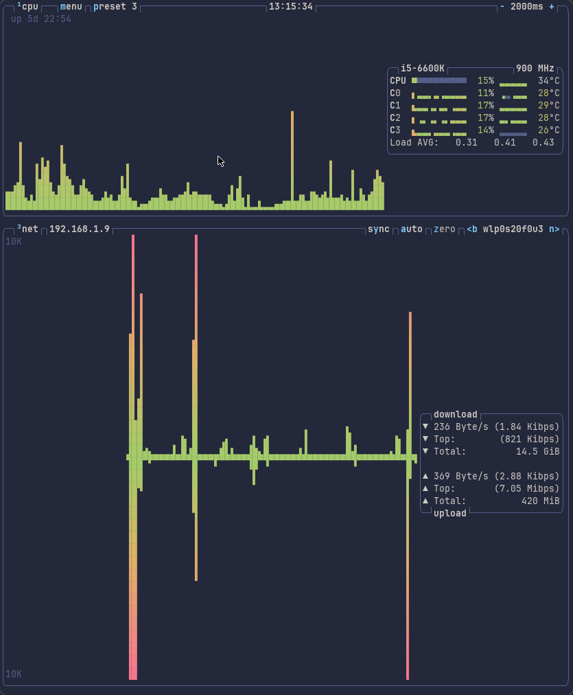

The contained script generates an empty FontForge font with only braile unicode symbols present.
The intended use is for displaying graphs, e.g. btop.
The parameters were selected to work with JetBrains Mono Regular.
 
